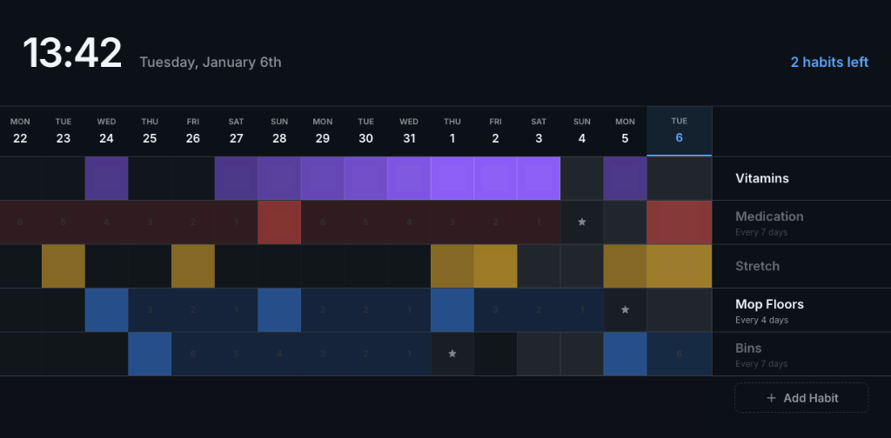

# Habit Tracker



A simple, edge-to-edge habit tracker designed for TrueNAS SCALE and local development.

## 🚀 Quick Start

### Development Mode


To start both the frontend (Vite) and the backend (Express) concurrently:

```bash
npm install
npm run dev
```

- **Frontend**: http://localhost:5173
- **Backend API**: http://localhost:3001 (proxied via `/api` in development)

### Production Build

To build the frontend and serve it via the Node.js backend:

```bash
npm run build
npm run server
```

## 🐳 Docker & TrueNAS Deployment

The app is containerized and ready for deployment as a custom app on TrueNAS SCALE (specifically versions like Electric Eel 24.10+ which support Docker Compose).

### 1. Build the Image
You must build the image locally on your TrueNAS machine or push it to a registry.

**To build locally on TrueNAS via SSH:**
1. SSH into your TrueNAS.
2. Copy your project files to a dataset.
3. Run:
   ```bash
   docker build -t habit-tracker:latest .
   ```

### 2. Install on TrueNAS SCALE
1. Log in to your TrueNAS SCALE web interface.
2. Navigate to **Apps** -> **Discover Apps**.
3. Click the **three dots (more_vert icon)** next to "Custom App".
4. Select **Install via YAML**.
5. Give your app a name (e.g., `habit-tracker`).
6. Paste the following YAML configuration into the **Custom Config** field:

```yaml
services:
  habit-tracker:
    image: habit-tracker:latest
    container_name: habit-tracker
    ports:
      - "9090:80"  # Change 9090 to any free port on your TrueNAS host
    volumes:
      - habit-data:/app/data
    restart: unless-stopped

volumes:
  habit-data:
```

### 3. Configure the "Web UI" Button
To get the "Web UI" button, you must also fill out the **Portal Configuration** section on the same installation screen:

1. Scroll down to **Portal Configuration**.
2. **Portal Name**: Enter `Web UI`.
3. **Protocol**: Select `HTTP`.
4. **Port**: Enter the **host port** you chose in the YAML (e.g., `9090`).
5. Click **Install**.

> [!TIP]
> **Avoiding Port Conflicts**: If you're already running another app on port 9090, simply change the first number in the YAML (e.g., `"9090:80"`) and use that same number (`9090`) in the Portal Configuration.

## 🛠️ Features
- **TrueNAS Ready**: Standard Docker Compose setup.
- **Data Persistence**: Data is saved to a JSON file in `/app/data`, which can be mapped to a TrueNAS dataset.
- **Elegant UI**: Dark mode, glassmorphism, and smooth animations.
